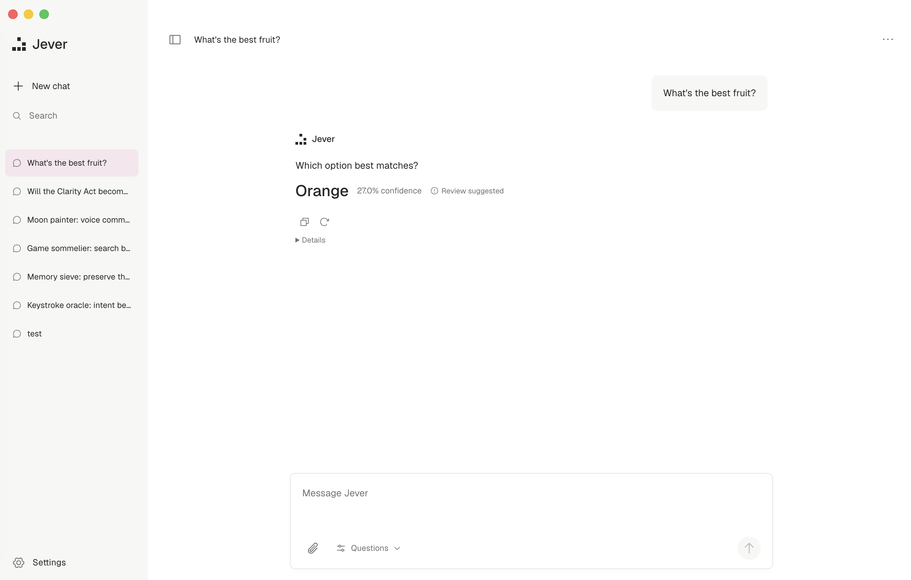

<h1 align="center">Jever</h1>

<p align="center">A desktop workspace for <a href="https://openrouter.ai/~typesafe/jev-latest">TypeSafe Jev</a> and <a href="https://ollaya.dev/">Ollaya</a>.</p>

<p align="center">
  <a href="#get-started">Get started</a> ·
  <a href="#using-jever">Using Jever</a> ·
  <a href="docs/development.md">Development</a>
</p>



Jev picks between options, scores against a rubric, and answers yes/no questions. Jever gives you a place to try those decisions: write a question, add some context, and see the answer alongside its confidence.

Conversations stay on your machine. Use an OpenRouter key for Jev, or run open decision models on your own Ollaya server.

## Get started

You'll need **Node.js 22.12+** and **pnpm 9.9+**. Choose Ollaya for local models or an [OpenRouter API key](https://openrouter.ai/keys) with credits and access to Jev.

```sh
git clone https://github.com/zeuzmakessoftware/jever.git
cd jever
pnpm install
pnpm dev
```

### Ollaya

[Install Ollaya](https://ollaya.dev/download), then run:

```sh
ollaya pull laya
ollaya serve
```

In the Jever desktop app, open **Settings → Connection**, select **Ollaya**, and save the server URL (default `http://localhost:11435`) and model (default `laya`). Click **Test & refresh models** to check the connection and discover installed models. You can select a discovered model or enter a custom model name, then save the connection.

No API key is needed by default. If the server sets `OLLAYA_API_KEY`, save that key in the Ollaya connection settings. Keys are encrypted with your operating system's secure storage, kept separate from OpenRouter, and scoped to the saved server URL. Save URL changes before saving a key. Remote servers and reverse-proxy URL prefixes are supported; use HTTPS for remote credentials.

Choice, Score, and Noul work with Ollaya, including mixed question batches, structured context, attachments, presets, and history. Results retain the actual model, routing, and timing information in Details. If Ollaya truncates your context, Jever displays a warning. Ollaya supports up to 256 questions, 255 choices per question, and 10 score levels; each model also has its own context and option budget. Jever retains its 120,000-character request limit. The JSON editor accepts choice label arrays and uses the question ID when instructions are omitted or null.

Models must already be installed (`ollaya pull <model>`); Jever does not download model weights. The first decision may wait for loading. Increase **Settings → Behavior → Request timeout** to 5 or 10 minutes if needed. Private provider routing applies only to OpenRouter.

### OpenRouter

Open **Settings → Connection**, select **OpenRouter**, paste your key, and save. Existing workspaces keep their OpenRouter connection. Jever uses your operating system's secure storage to encrypt the key.

Tested on macOS with Apple Silicon. Windows and Linux packaging haven't been verified yet.

## Using Jever

Click **Questions** in the message bar to set up what you want Jev to decide. Start with a preset or write your own.

| Question type | What you give it                    | What comes back             |
| ------------- | ----------------------------------- | --------------------------- |
| **Choice**    | A question and possible answers     | A selected option           |
| **Score**     | A question and ordered score levels | A score against your rubric |
| **Noul**      | A yes/no condition                  | A boolean verdict           |

Paste context into the message bar or attach text files, then send. Open **Details** under an answer to inspect probabilities, usage, and the response JSON. A result below your review threshold stays visible with a review flag.

You can ask several questions in one request, save question sets as presets, and edit their JSON when you need more control. Background context and optional conversation history carry information between turns.

The sidebar keeps your conversations searchable. You can pin, rename, export, or delete them, and back up the whole workspace from Settings. Light and dark themes, accent colors, and text size live there too.

**Shortcuts:** `⌘/Ctrl+N` starts a chat, `⌘/Ctrl+K` searches, and `⌘/Ctrl+,` opens Settings. `Shift+Enter` adds a line.

## Where your data goes

Your key is encrypted locally and excluded from workspace exports. Conversations and backups are stored as **unencrypted JSON**.

When you run a decision, Jever sends the input, attachments, background context, and any enabled history to the selected provider. Ollaya requests go directly to the configured server; a server on your machine keeps inference local. OpenRouter requests use `~typesafe/jev-latest` with model fallbacks disabled. The optional private routing setting asks for providers that decline data collection; this can reduce availability.

See [development notes](docs/development.md) for storage paths, transport details, and security boundaries.

## Working on it

Built with Electron, React, TypeScript, and Tailwind CSS.

```sh
pnpm typecheck
pnpm test
pnpm build
pnpm start
```

`pnpm dev:web` runs a browser preview at `http://127.0.0.1:5173`. It has a separate local workspace; live requests and API keys are only available in the desktop app.

For a local app bundle, run `pnpm package`. For a distributable on your current platform, run `pnpm dist`. Public macOS distribution needs signing and notarization configured separately.

The [development notes](docs/development.md) cover tests and source layout. The original visual concepts are in [design](design/README.md).

---

Jever is an independent project for [TypeSafe Jev](https://docs.typesafe.ai/introduction). It isn't affiliated with TypeSafe, OpenRouter, or Ollaya.
